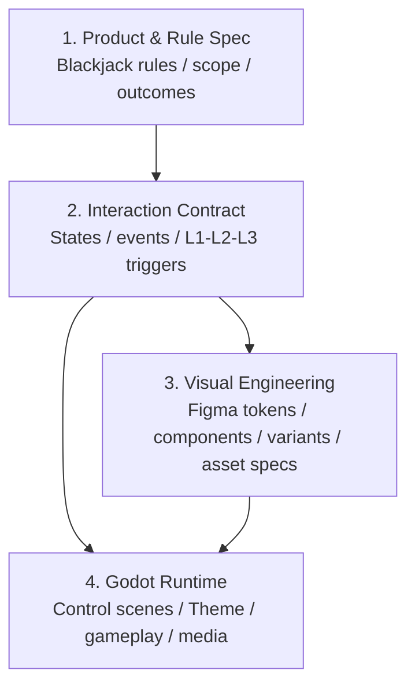
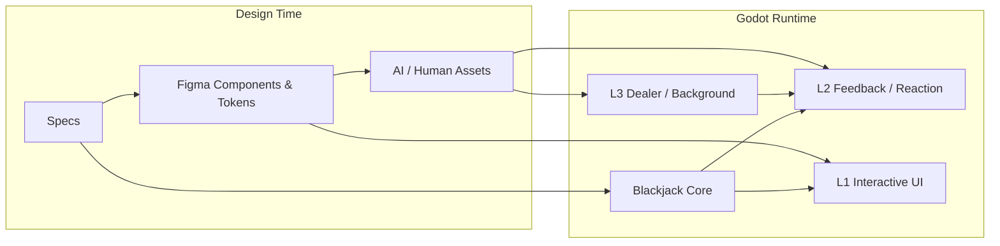

# 00 - AI-Native Game Development Blueprint

## 1. Consultant Conclusion

目前方向是正確的，但需要一個明確的中間層。

只用「Figma → Godot」會缺少遊戲事件與狀態的語意；只用「規格 → Godot」則會讓視覺細節難以維護。

因此採四層：



這個中間層就是 `Interaction Contract`。

它回答：

- 玩家按 HIT 時產生什麼事件？
- 哪一個核心狀態改變？
- 哪些 L2 演出是 blocking？
- 哪一個 L3 loop 應該保持或恢復？
- UI 哪些元件 enabled／disabled？

---

## 2. Design Time 與 Runtime 是不同維度



L1/L2/L3 定義玩家執行遊戲時看到的體驗層。

Figma Components／Tokens 定義設計與維護時如何管理元件。

兩者互補，不互相取代。

---

## 3. 三個 Source of Truth

### 行為

Markdown Specs。

### 視覺

Figma 中已批准的 Component、Variant、Token 與 Screen。

### 執行

Godot repository。

三者透過穩定 ID 連接：

```text
BTN_ACTION_HIT
  Figma component/node
  Godot scene/path
  Interaction action id: HIT
```

---

## 4. 為什麼這比「整張 AI UI 圖」更好

整張圖的問題：

- Button 不能獨立改。
- 文字與狀態難替換。
- 不同解析度會變形。
- AI 每次局部修改可能重畫整張。
- Hit area 與視覺容易錯位。
- Codex 只能猜元件邊界。

元件化後：

- Figma 修改單一 component。
- Godot 修改對應 scene／theme。
- 只重匯出改動 asset。
- Screenshot regression 可定位差異。
- UI 品質不依賴「再抽一次 AI 圖」。

---

## 5. 不過，不是所有東西都要元件化

只有以下內容值得做成 component/token：

- 會重複。
- 會改狀態。
- 會變文字。
- 會 resize。
- 玩家可操作。
- 需要跨畫面保持一致。

一次性的劇情畫面、Dealer reaction clip、單一背景美術，不需要被拆成過多小元件。

這是避免過度工程化的界線。

---

## 6. 最小製作鏈

```text
Approved Spec
→ Interaction Contract
→ Figma Component / Asset Spec
→ Godot Placeholder Implementation
→ Rule Test
→ Visual Integration
→ Screenshot / Playtest
→ Human Approval
```

不要先完成所有正式圖再寫遊戲；也不要先把所有 UI 寫死再回頭整理 Figma。
