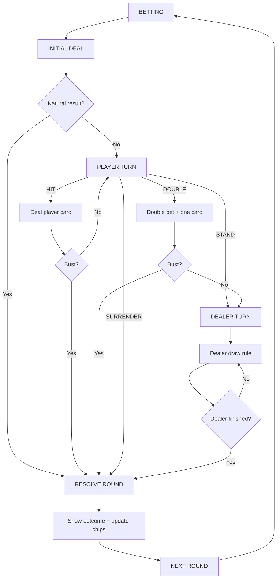

# 01 - Game and Layer Spec

## 1. Product

直式 Blackjack／21 點遊戲。

畫面重點：

- Dealer 角色是主要視覺焦點。
- Blackjack 牌桌 UI 疊在 Dealer／背景上。
- 玩家透過 HIT、STAND、DOUBLE、SURRENDER 操作。
- 操作與結果觸發 Dealer／牌桌回饋。
- 長時間等待時維持 Dealer／背景 loop。

---

## 2. Reference Canvas

Prototype 建議先採：

```text
Orientation: Portrait
Aspect ratio: 9:16
Reference frame: 1080 × 1920
```

這是 prototype reference，不代表最終只支援單一解析度。

Godot 必須使用 anchors、containers 與安全區設計，不能依賴固定座標堆滿畫面。

---

## 3. Runtime Layers

### LAYER-1 - 可操作 GUI

```text
Dealer Hand
Player Hand
Player Total
HIT
STAND
DOUBLE
SURRENDER
Bet Controls
Chips
Result / Status
```

規則：

- 每個可點擊元件為獨立 Control／Scene。
- 文字由 Godot Label 顯示，不烙在背景圖上。
- 不合法 action 必須 disabled 或 hidden，依已批准 UX spec。

### LAYER-2 - 即時回饋

```text
Deal Card
Flip Card
Total Update
Win / Lose / Push
Bust / Blackjack
Bet / Chip Change
Dealer Reaction
Sound / FX / Short Video
```

L2 可分：

1. Gameplay feedback：發牌、翻牌、點數、籌碼。
2. Character feedback：Dealer reaction。

### LAYER-3 - 持續背景與進程狀態

```text
Dealer idle loop
Dealer waiting loop
Background ambience
Progression-specific Dealer state
```

L3 在等待玩家時持續存在；L2 可 overlay 或暫時替換它，之後恢復。

---

## 4. Main Game Loop



---

## 5. MVP

第一個 Vertical Slice 必須能：

- 設定合法 bet。
- Initial deal。
- 顯示 Dealer / Player hand。
- HIT。
- STAND。
- DOUBLE。
- SURRENDER。
- Dealer turn。
- Win / Lose / Push / Bust / Blackjack outcome。
- 更新 chips。
- 開始下一局。
- L1 使用獨立 placeholder 元件。
- L2 使用 placeholder animation／label。
- L3 使用 placeholder Dealer／background。

---

## 6. Not in First Vertical Slice

- Split
- Insurance
- Side bets
- Multiplayer
- Account / backend
- Shop / achievement
- Complex story branch
- Multiple Dealer characters
- Live AI generation at runtime
- 3D free camera
- Full progression system

---

## 7. Quality Priorities

1. Rule correctness。
2. No duplicate resolution。
3. Clear legal actions。
4. Responsive independent UI components。
5. Correct L2 event mapping。
6. Smooth L3 continuity。
7. Visual polish。
8. Extra content。
