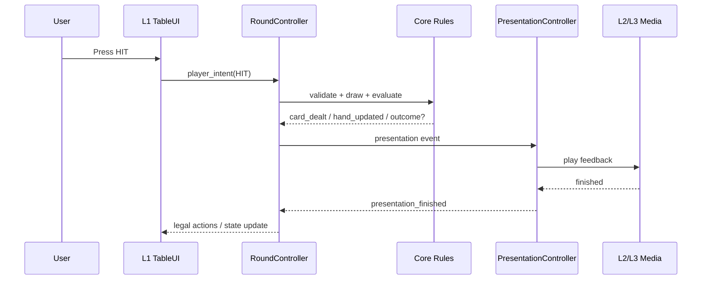

# 03 - Interaction and Presentation Contracts

## 1. Purpose

本文件是規則、Figma 與 Godot 之間的中間層。

它不描述美術長什麼樣，而是描述：

- 哪個玩家意圖有效。
- 哪個狀態改變。
- 哪個 L1 元件狀態改變。
- 哪個 L2 event 被觸發。
- 哪個 L3 loop 應維持或恢復。

---

## 2. WAIT / HOLD / LOOP 對應

原始簡報概念在本專案中轉成：

| 簡報概念 | Runtime Contract |
|---|---|
| WAITING FOR USER RESPONSE | `PLAYER_TURN` 或 `BETTING`，L1 接受合法操作 |
| HOLD | Input barrier；等待 blocking L2 完成 |
| LOOP | L3 Dealer／background loop |
| L2 演出後向下發展 | `presentation_finished` 後繼續 state transition |
| 分歧 | 由 game outcome／progression spec 決定，不由影片檔決定 |

---

## 3. Event Direction



---

## 4. Core Events

第一個 Vertical Slice 使用以下 canonical IDs：

```text
ROUND_STARTED
INITIAL_CARD_DEALT
PLAYER_CARD_DEALT
DEALER_HOLE_CARD_REVEALED
DEALER_PEEK_COMPLETED
DEALER_CARD_DEALT
PLAYER_HAND_UPDATED
DEALER_HAND_UPDATED
PLAYER_BUSTED
DEALER_BUSTED
ROUND_RESOLVED
CHIPS_CHANGED
BET_CHANGED
```

Gameplay event payload 至少包含 `round_id` 與遞增 `sequence_no`。Card／hand event 另帶 `hand_owner`、`card`、`face_up`；resolve event 另帶 `outcome`、`committed_bet`、`chip_delta`、`chips_after`。Dealer hole card reveal 前不得把暗牌或完整 Dealer total 放入 L1 payload。

---

## 5. Interaction Matrix

| Player intent | Valid state | Core effect | Blocking L2 | Next state |
|---|---|---|---|---|
| `PLACE_BET` | BETTING | validate bet | optional chip feedback | BETTING |
| `DEAL` | BETTING | commit bet, P-D-P-D, peek if required | deal sequence | PLAYER_TURN or RESOLVE_ROUND |
| `HIT` | PLAYER_TURN | draw one | card deal | PLAYER_TURN, DEALER_TURN at 21, or RESOLVE_ROUND |
| `STAND` | PLAYER_TURN | close player turn | optional confirm | DEALER_TURN |
| `DOUBLE` | PLAYER_TURN, legal | double bet, draw one | bet + card | DEALER_TURN or RESOLVE_ROUND |
| `SURRENDER` | PLAYER_TURN, legal | close round | surrender reaction | RESOLVE_ROUND |
| `NEXT_ROUND` | ROUND_END | reset round | transition | BETTING |

---

## 6. Blocking vs Non-Blocking Presentation

### Blocking

流程必須等待結束：

- 卡片尚未進入 hand 前的 deal animation。
- Dealer hole card reveal。
- 必須先播放完才能進入下一 round 的 result transition。

### Non-Blocking

不應阻塞核心：

- ambient particle。
- background idle loop。
- subtle glow。
- 可與 UI 更新同時進行的短音效。

每個 Presentation Spec 必須標註：

```text
blocking: true / false
fallback_duration_ms
```

---

## 7. Input Barrier

當 blocking L2 開始：

```text
ActionBar.disabled = true
```

當它完成或 fallback timeout：

```text
RoundController decides the next legal actions
ActionBar reflects those actions
```

PresentationController 不可自行猜下一個 game state。

每次 blocking presentation 都使用唯一 `presentation_token`。正常完成與 fallback timeout 必須競爭同一個 exactly-once completion guard；遲到的第二次 completion 只記錄 diagnostic，不得再次推進 state。

---

## 8. Failure Fallback

若影片或動畫載入失敗：

1. Log asset ID 與錯誤。
2. 使用文字／簡單 Tween fallback。
3. 在有限時間內送出 `presentation_finished`。
4. 不得永久卡在 HOLD。

---

## 9. L2/L3 Mapping Example

```text
Core outcome: PLAYER_WIN
L2 gameplay: chips increase animation
L2 character: dealer_player_win_reaction
L3 resume: dealer_idle_current_progression
```

Core 只輸出 `PLAYER_WIN`；實際 asset 由 Presentation mapping 決定。
