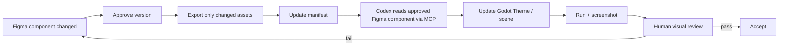

# 05 - Figma to Godot Implementation

## 1. Important Boundary

Figma MCP 提供 design context，不會自動把 Figma 變成品質可靠的 Godot Scene。

Codex 的任務是把已批准的 Figma 定義翻譯成專案既有的 Godot pattern。

---

## 2. Mapping Strategy

| Figma | Godot |
|---|---|
| Frame / Auto Layout | `Container` / anchors / size flags |
| Component | `.tscn` reusable scene |
| Variant | Theme type variation / property / state |
| Color variable | `Theme` color / project token resource |
| Typography variable | Font / font size in `Theme` |
| Radius / border | `StyleBoxFlat` |
| Stretchable textured panel | `NinePatchRect` / `StyleBoxTexture` |
| Icon | Texture2D / SVG / PNG / WebP |
| Dynamic text | `Label` / `RichTextLabel` |
| Full visual screen | Composition of scenes, never one flat image |

---

## 3. Recommended Scene Tree

```text
GameRoot
├── L3Root
│   ├── BackgroundView
│   └── DealerIdleView
├── L2Root
│   ├── CardAnimationLayer
│   ├── DealerReactionLayer
│   ├── ResultOverlay
│   └── FXLayer
├── L1Root
│   └── TableUI
│       ├── DealerHandView
│       ├── PlayerHandView
│       ├── HandTotal
│       ├── ResultBanner
│       ├── ActionBar
│       ├── ChipsDisplay
│       └── BetControl
├── RoundController
└── PresentationController
```

Canvas layering：

```text
L3 lowest
L2 middle
L1 highest
```

特例：某些 L2 visual 可以覆蓋 L1，但 input blocker 要獨立且明確。

---

## 4. UI Scenes

**架構說明用，非權威登記表**：實際存在哪些 `.tscn`、對應哪個 Figma Component、目前同步狀態，一律以 `docs/12_FIGMA_COMPONENT_MANIFEST.md` 為準。

已建立：

```text
res://ui/components/action_button.tscn
res://ui/components/action_bar.tscn
res://ui/components/card_view.tscn
res://ui/components/deal_button.tscn
res://ui/components/value_display.tscn
```

規劃中，尚未建立（目標路徑,非現況）：

```text
res://ui/components/hand_view.tscn
res://ui/components/result_banner.tscn
```

`TableUI` 目前是 `scenes/game_root.tscn` 內的一個 `MarginContainer` 節點，不是獨立 `.tscn`（原規劃的 `res://ui/table_ui.tscn` 尚未拆出）；若日後拆成獨立 scene，應同步更新此節。

每個 scene 只負責一個可理解的視覺／互動單位。

---

## 5. Theme First

重複的 Button、Label、Panel 外觀不要在每個 node 使用大量 local override。

優先：

```text
Theme Resource
Theme type variations
StyleBoxFlat
StyleBoxTexture
Font resources
Semantic constants
```

這樣修改 Figma token 時，Codex 可以更新 Theme，而不是逐個 node 修值。

---

## 6. Asset Format

### Static raster

- PNG：透明與精準邊緣。
- WebP：可透明且可減少檔案大小；需目視確認壓縮品質。

### Vector

- SVG 適合簡單 icon。
- Godot 匯入 SVG 時會 rasterize；複雜 SVG 可能不完整，文字應轉 path。

### Stretchable UI

- 優先 native StyleBox。
- 必須是紋理時使用 Nine Patch，記錄 patch margin。

### Text

- 一律使用 Godot text node。
- 不把 Chips、Bet、HIT 等文字烙進圖片。

---

## 7. Sync Workflow



---

## 8. Codex Implementation Rules

當收到 Figma link／node：

1. 先辨識 semantic component ID。
2. 比對既有 Godot scene。
3. 優先更新 Theme／variant，不重建整個 scene。
4. 不把 React-like MCP output 原樣當 Godot code。
5. 不因 Figma visual change 修改 Blackjack rules。
6. Run 指定 viewport。
7. 產生 before／after screenshot。

---

## 9. Responsive Rules

- 以 1080×1920 為 reference。
- 使用 Containers 與 anchors。
- ActionBar 保持在安全操作區。
- Dealer hand、Player hand、ActionBar 不重疊。
- Dealer visual 可以 crop，但牌與數值不可被 crop。
- 測試至少 reference、較窄、較寬三種 viewport。

---

## 10. Enterprise MCP Read/Write Workflow

本專案的主要 handoff 使用 Figma MCP 完整讀寫：

1. Codex 讀取指定 Figma file、node、component 與批准版本。
2. 比對 Component Manifest 與既有 Godot Theme／Scene。
3. 依批准 spec 定向修改 Component、Variant、Token／Variable 或 Screen。
4. 使用者在 Figma 審核並批准該版本。
5. 只匯出 Godot 真正需要的 texture／media；動態文字與可互動元件保持 native。
6. 更新 Component Manifest 與 Godot implementation。
7. 在 reference、narrow、wide portrait viewport 執行 Screenshot QA。

任何 MCP 寫入不得擴張到未指定的元件或畫面；缺少 node ID、variant 定義或批准規格時，回報 `DESIGN REQUIRED`。
