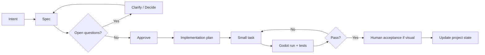

# 07 - SDD Workflow

## 1. Project Definition

專案內統一使用：

`SDD - Spec-Driven Development`

目標不是增加文件數量，而是避免 Codex 在重要決策上猜測。

---

## 2. The Workflow



---

## 3. Four Gates

### Gate A - Rule Gate

Blackjack correctness 需要的規則都已定義。

未通過：`SPEC REQUIRED`

### Gate B - Interaction Gate

Action、state、event、blocking behavior 定義完成。

未通過：`INTERACTION SPEC REQUIRED`

### Gate C - Visual Gate

Figma component／asset spec 已批准。

未通過：`DESIGN REQUIRED` 或 `ASSET REQUIRED`

### Gate D - Acceptance Gate

自動測試 pass，視覺需人工判斷者已審核。

未通過：`HUMAN APPROVAL REQUIRED`

---

## 4. Smallest Useful Specs

推薦 feature 單位：

```text
Hand evaluation
Initial deal
HIT
STAND
Dealer turn
Round resolution
Bet ledger
DOUBLE
SURRENDER
Action button component
Card view component
L2 card deal feedback
L2 result reaction
L3 dealer idle
```

不要用：

```text
Build the whole game
Build the whole design system
Generate all art
```

---

## 5. Spec Status

```text
DRAFT
NEEDS_DECISION
APPROVED
IMPLEMENTING
VERIFYING
HUMAN_REVIEW
DONE
DEPRECATED
```

只有 `APPROVED` 才能開始正式 implementation。

技術 placeholder 可以用明確標記的 `PROTOTYPE APPROVED`。

---

## 6. Implementation Plan Requirements

Codex 必須列出：

- Existing files reused。
- Files created／changed。
- Core rules affected。
- L1/L2/L3 affected。
- Tests。
- Fallback。
- Explicit non-goals。

計畫若需要一次改很多不相關檔案，應重新切小。

---

## 7. Visual Feature Workflow

```text
Component Spec
→ Figma component/variant
→ Human approval
→ Export / MCP handoff
→ Godot scene/theme update
→ Screenshot test
→ Human approval
```

AI 生成素材只是 Component Spec 的一種實作，不是規格本身。

---

## 8. Change Control

若實作發現規格需改：

1. 停止擴大修改。
2. 更新 spec proposal。
3. 說明影響。
4. 使用者批准。
5. 再改 implementation。

不要偷偷讓 code 成為新規格。
